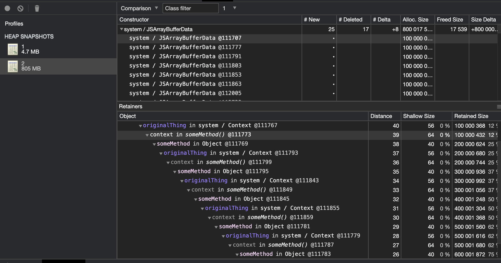

Node memory leak demo

## Start
```yarn``` for installing dependencies packages

```yarn debug``` for running the code


## Dump memory profiles

```heapdump -f {filename}```

for example:
```heapdump -f abc``` will dump heap memory profile to folder who's named heapsnapshot

## Memory profiles screenshot


## refs:

[V8 GC Bug](https://bugs.chromium.org/p/chromium/issues/detail?id=315190)

[An interesting kind of JavaScript memory leak](https://blog.meteor.com/an-interesting-kind-of-javascript-memory-leak-8b47d2e7f156)

[Understanding Garbage Collection and hunting Memory Leaks in Node.js](https://www.dynatrace.com/news/blog/understanding-garbage-collection-and-hunting-memory-leaks-in-node-js/)

